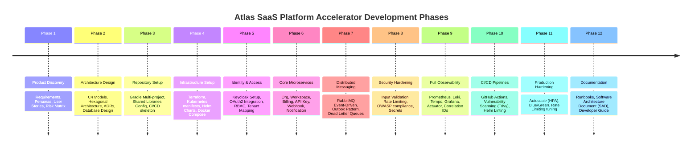

# Product Roadmap: Atlas SaaS Platform Accelerator

This roadmap outlines the long-term execution plan for the Atlas SaaS Platform Accelerator across the 12 key phases.

---

## Roadmap Phases

### Phase 1: Product Discovery (Current)
*   **Goal:** Formulate product scope, business logic, customer profiles, and roadmap metrics.
*   **Deliverables:**
    *   Vision & Competitive Analysis
    *   Functional & Non-Functional Requirements
    *   User Stories & Personas
    *   Product Backlog & Risk Matrix
*   **Target:** Sprint 1

### Phase 2: Architecture Design
*   **Goal:** Establish architecture blueprints using DDD, clean architecture, and C4 patterns.
*   **Deliverables:**
    *   C4 Model Diagrams (System, Container, Component, Deployment)
    *   Database Schema Entity-Relationship Diagrams (ERD)
    *   Architecture Decision Records (ADRs) for framework and database choices
    *   API-First designs using OpenAPI/Swagger specs
*   **Target:** Sprint 2

### Phase 3: Repository Setup & Skeleton
*   **Goal:** Construct an enterprise-grade Gradle multi-project build setup with Java 21 and Spring Boot 3.
*   **Deliverables:**
    *   Root Gradle project containing shared build logic (Conventions plugins)
    *   Shared Core libraries for common exception handling, logging context, and utility classes
    *   Spring Cloud Gateway skeleton
    *   Identity & Organization service skeletons
*   **Target:** Sprint 3

### Phase 4: Local & Cloud Infrastructure
*   **Goal:** Provide full infrastructure scripts using Docker Compose and Kubernetes.
*   **Deliverables:**
    *   Docker Compose file for local external services (Postgres, Redis, Keycloak, RabbitMQ, MinIO)
    *   Terraform configurations for production-like cloud infrastructure
    *   Helm charts for application microservices
    *   Kubernetes manifests (ConfigMaps, Secrets, resource constraints)
*   **Target:** Sprint 4

### Phase 5: Identity & Authentication Services
*   **Goal:** Secure the platform boundaries and provide tenant-isolated access controls.
*   **Deliverables:**
    *   Keycloak realm configuration and user profiles
    *   OAuth2/OIDC login flow configuration
    *   JWT claim customization to support multi-tenant contexts
    *   Spring Security configurations across services for RBAC
*   **Target:** Sprint 5

### Phase 6: Core Microservices Implementation
*   **Goal:** Build out the core functional services.
*   **Deliverables:**
    *   **Organization, Workspace, and Team Services:** Manage tenant membership and hierarchical configurations
    *   **Subscription & Billing Abstraction Service:** MockBillingProvider, StripeBillingProvider integration, plan limits, and quotas
    *   **File Storage Service:** MinIO S3-compatible integration
    *   **API Key Management Service:** Key generation, hashing, and authorization validation
    *   **Webhook & Notification Services:** Inbound event callbacks and multi-channel notifications (email, etc.)
*   **Target:** Sprints 6-8

### Phase 7: Event-Driven Architecture (RabbitMQ)
*   **Goal:** Decouple services and enable reliable asynchronous operations.
*   **Deliverables:**
    *   Transactional Outbox Pattern implementation
    *   Idempotent message consumers
    *   RabbitMQ configuration with Dead Letter Queues (DLQ) and retry policies
    *   Distributed events execution (UserRegistered, SubscriptionChanged, etc.)
*   **Target:** Sprint 9

### Phase 8: Platform Security & Policy Enforcement
*   **Goal:** Secure data at rest, in transit, and enforce tenant isolation.
*   **Deliverables:**
    *   Tenant isolation validations at database connection level (row-level security or schema-per-tenant design)
    *   Input sanitization, CORS, CSRF, and secure security headers
    *   API rate limiting policies (Token Bucket via Redis)
    *   Automated static security analysis integration (Trivy, OWASP dependency checks)
*   **Target:** Sprint 10

### Phase 9: Distributed Observability
*   **Goal:** Deliver 360-degree visibility into system health and tracing.
*   **Deliverables:**
    *   Actuator metrics and Prometheus endpoints integration
    *   Grafana dashboards for business metrics (SaaS quotas) and system metrics (CPU/Memory/JVM)
    *   Structured logs aggregated into Grafana Loki
    *   Distributed Tracing with OpenTelemetry/Tempo/Jaeger including correlation IDs
*   **Target:** Sprint 11

### Phase 10: CI/CD Pipeline Automations
*   **Goal:** Set up continuous integration, testing, and automated deployment pipelines.
*   **Deliverables:**
    *   GitHub Actions workflows for testing and code validation
    *   Testcontainers setup for reliable integrations tests (Postgres, RabbitMQ, Redis, Keycloak)
    *   Docker image builds and publishing to registry
    *   Kubernetes deployments validation via dry-runs
*   **Target:** Sprint 12

### Phase 11: Production Hardening
*   **Goal:** Prepare the platform for high availability and traffic spikes.
*   **Deliverables:**
    *   Kubernetes Horizontal Pod Autoscalers (HPA) definition
    *   Blue/Green and Rolling Update deployment configurations
    *   Distributed cache tuning (Redis cluster configurations)
    *   Load testing and bottleneck analysis
*   **Target:** Sprint 13

### Phase 12: Documentation & Launch
*   **Goal:** Deliver documentation that makes the repository a flagship portfolio piece.
*   **Deliverables:**
    *   Software Architecture Document (SAD) with system architecture explanations
    *   Developer Runbooks and Troubleshooting guide
    *   Contributing Guide and coding standards
    *   Release Notes
*   **Target:** Sprint 14
