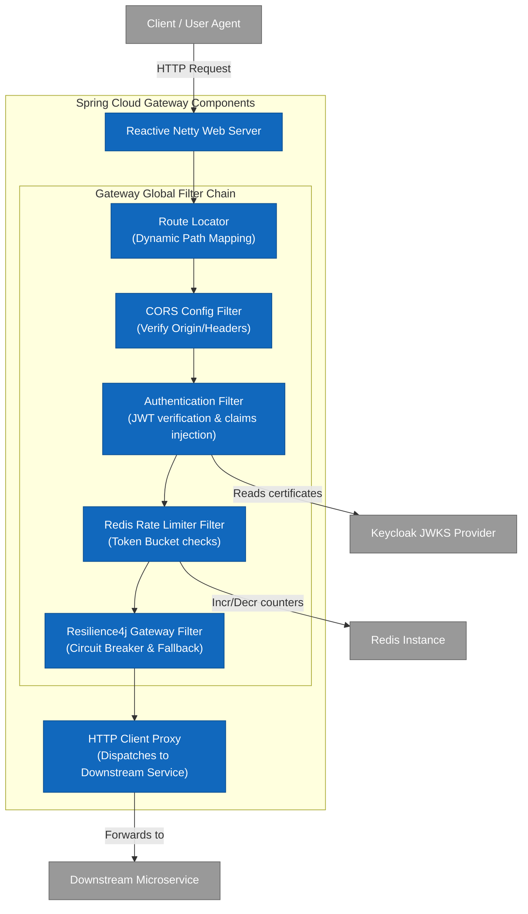
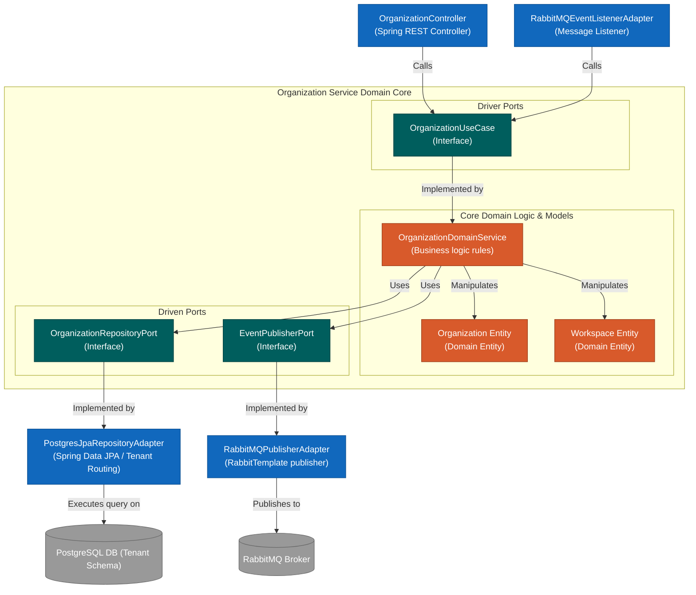

# Architecture: Components (C4 Level 3)

This document drills down into C4 Level 3 Component diagrams for key blocks: the **Spring Cloud Gateway** and the **Organization Service**.

---

## 1. Spring Cloud Gateway Component Diagram

The Gateway acts as the secure ingress controller for all platform services, coordinating rate limits, security, and routing.

*   **Authentication Filter:** Parses the `Authorization: Bearer <JWT>` header, validates the cryptographic signature using Keycloak's JSON Web Key Sets (JWKS) keys, extracts tenant and user scopes, and inserts `X-Tenant-ID`, `X-User-ID`, and `X-User-Roles` headers.
*   **Redis Rate Limiter Filter:** Implements a token bucket algorithm to rate-limit requests per tenant and IP address.
*   **Circuit Breaker:** Wraps outbound calls to downstream microservices. If a service experiences downtime or high latency, the Gateway quickly drops the request and serves a graceful HTTP fallback response.

---

## 2. Organization Service (Hexagonal Architecture)

The Organization Service adheres to Hexagonal Architecture (Ports & Adapters) principles to isolate the core domain models from external database adapters, framework bindings, or message queues.

*   **Driver Adapters (Input):** `OrganizationController` receives HTTP REST requests, maps them into domain request commands, and triggers the `OrganizationUseCase` port.
*   **Domain Core:** Contains the core entity models (`Organization`, `Workspace`, `Team`) and business domain rules. It has no dependencies on Spring, Hibernate, or database engines.
*   **Driven Adapters (Output):** The repositories implement the outgoing ports. The `PostgresJpaRepositoryAdapter` uses tenant context-aware routing to direct statements to the tenant's isolated database schema.
