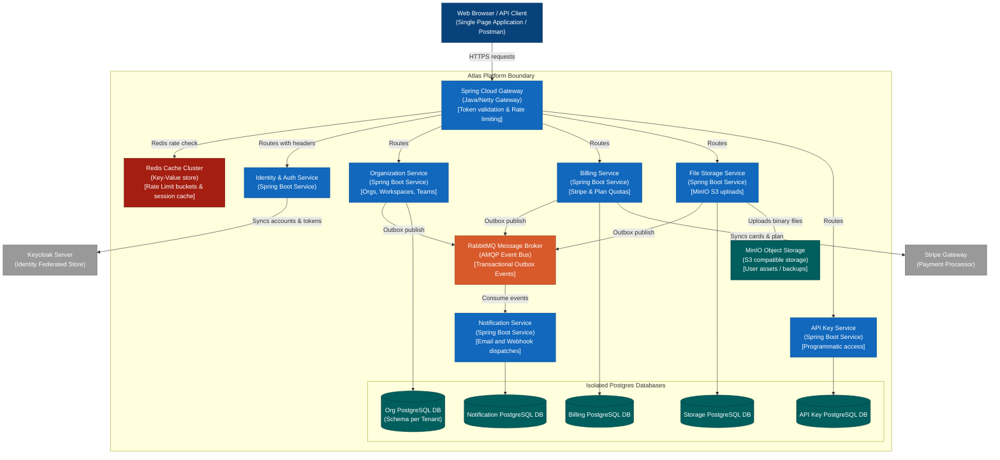

# Architecture: Containers (C4 Level 2)

This document shows the container architecture (C4 Level 2) for the **Atlas SaaS Platform Accelerator**. It illustrates how logical microservices, caches, and databases are organized and communicate with each other.

---

## 1. Container Diagram

---

## 2. Container Registry and Roles

### Spring Cloud Gateway (Port `8080`)
*   **Role:** Acts as the reverse proxy for all inbound REST APIs.
*   **Features:** Intercepts traffic, queries Redis to verify rate limits, uses public Keycloak certificates to validate JWT signatures offline, extracts tenant claims, and forwards metadata headers downstream.

### Identity & Auth Service (Port `8081`)
*   **Role:** Manages the integration bridge with Keycloak.
*   **Features:** Handles registration callback validation, profiles mapping, password reset requests redirection, and role synchronization.

### Organization Service (Port `8082`)
*   **Role:** Manages tenants, workspaces, and memberships.
*   **Features:** Handles organization creation, team structures, workspace division, and membership invites. Uses dynamic routing to isolate each organization's data into its own PostgreSQL schema (Schema-per-Tenant model).

### Billing Service (Port `8083`)
*   **Role:** Governs subscriptions, billing cycles, and feature locks.
*   **Features:** Implements a pluggable billing strategy via the `BillingProvider` interface. Enforces usage quotas in real-time.

### File Storage Service (Port `8084`)
*   **Role:** Secure file ingestion.
*   **Features:** Translates client uploads into private/public S3 bucket uploads in MinIO. Stores file size and tenant attribution metadata in PostgreSQL.

### Notification Service (Port `8085`)
*   **Role:** Orchestrates outbound notifications.
*   **Features:** Consumes events published to RabbitMQ (e.g., `UserRegistered`, `InvitationAccepted`) and dispatches emails via SMTP or triggers outbound webhooks.

### API Key Service (Port `8086`)
*   **Role:** Programmatic credentials validation.
*   **Features:** Generates and validates hash-based keys for external scripts or developer integrations.

---

## 3. Shared Caches and Datastores

*   **Redis:** Local high-performance cache. Used by the Gateway for IP/tenant rate-limiting counts, and by core services for tenant metadata and plan quotas lookup.
*   **Isolated PostgreSQL Instances:** Each microservice operates its own database. Services NEVER directly read or write to other services' tables, enforcing strict microservice coupling boundaries.
*   **RabbitMQ:** Enforces event-driven data flow across services (e.g. Org Service alerts Billing Service via event when an organization is deleted).
*   **MinIO Object Storage:** Serves as the developer-friendly S3 interface for storing document uploads, profile pictures, and backups.
