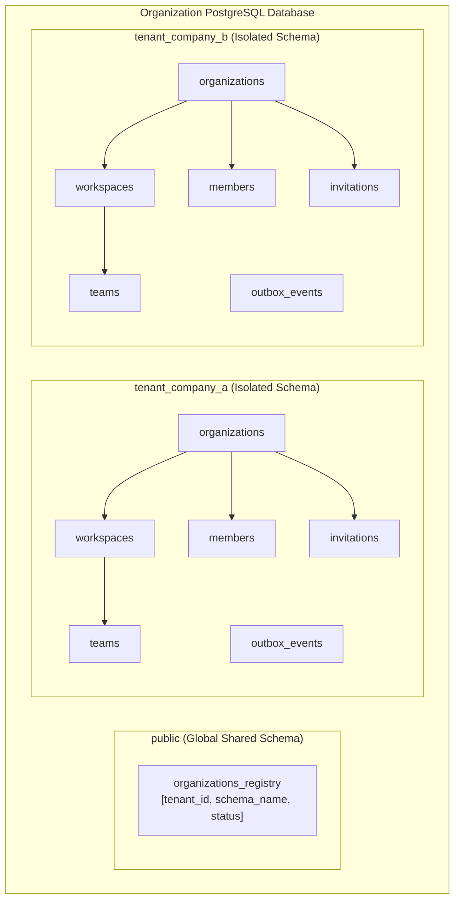
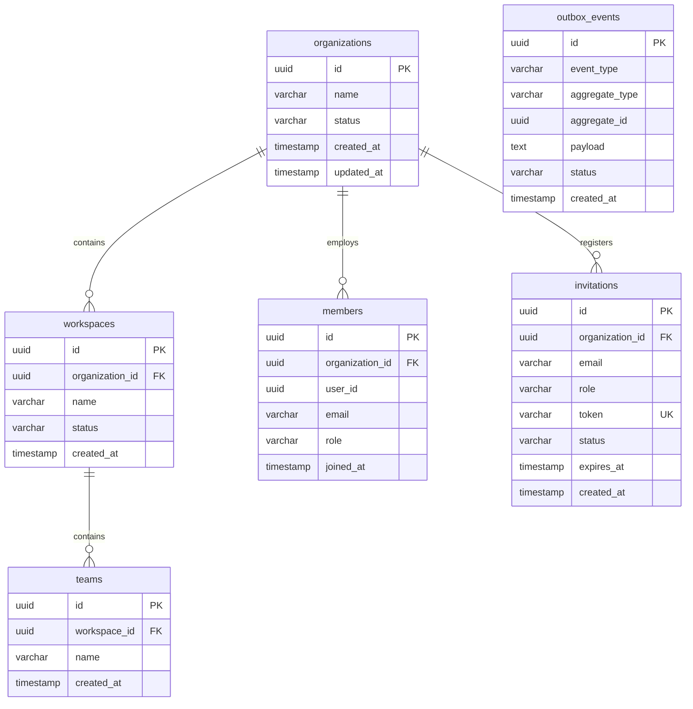
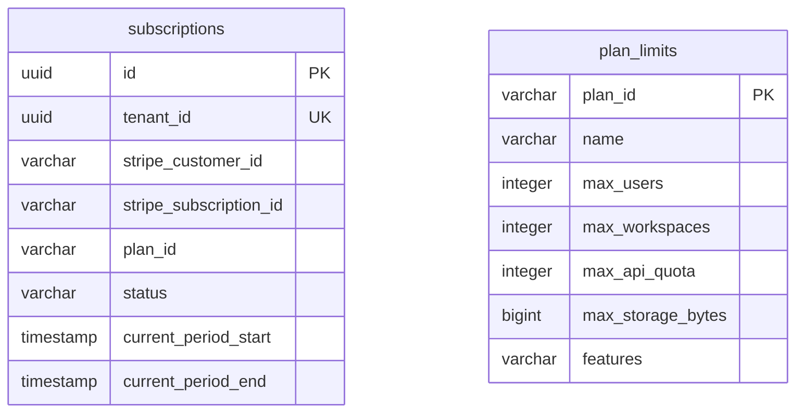
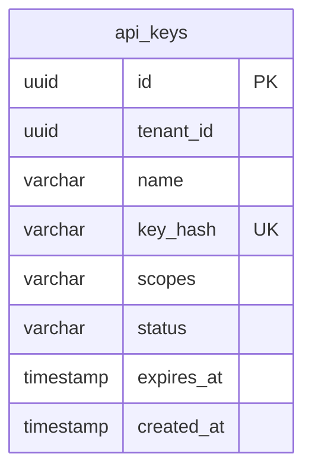
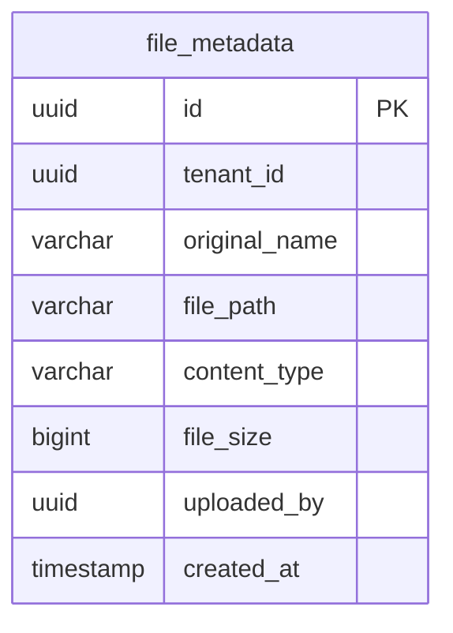

# Architecture: Database Relationships & Tenant Isolation

This document outlines the database schemas, relationships, and the technical implementation of tenant isolation in the **Atlas SaaS Platform Accelerator**.

---

## 1. Multi-Tenant Database Isolation Model

Atlas implements the **Schema-per-Tenant** isolation model for the core Organization/Workspace service, and the **Logical Tenant Separation** (Shared Table with Tenant ID filter) for downstream metadata services (Billing, API Keys, File Metadata, Audit Logs).

### Dynamic Tenant Context Routing
1.  **Request Ingestion:** The gateway validates the JWT, extracts `tenant_id`, and sets the header `X-Tenant-Id`.
2.  **ThreadLocal Injection:** A Spring interceptor intercepts the request downstream, reads the `X-Tenant-Id` header, and registers it to a `TenantContext` thread-local variable.
3.  **DataSource Routing:** Hibernate's `MultiTenantConnectionProvider` retrieves a connection, and `CurrentTenantIdentifierResolver` executes `SET search_path TO <tenant_schema_name>` dynamically before executing any query.

---

## 2. Microservice Entity-Relationship Diagrams (ERD)

### 1. Organization & Hierarchy Service Schema (Schema-per-Tenant)

Within each tenant's schema:

### 2. Subscription & Billing Service Schema

### 3. API Key Service Schema

### 4. File Storage Service Schema

