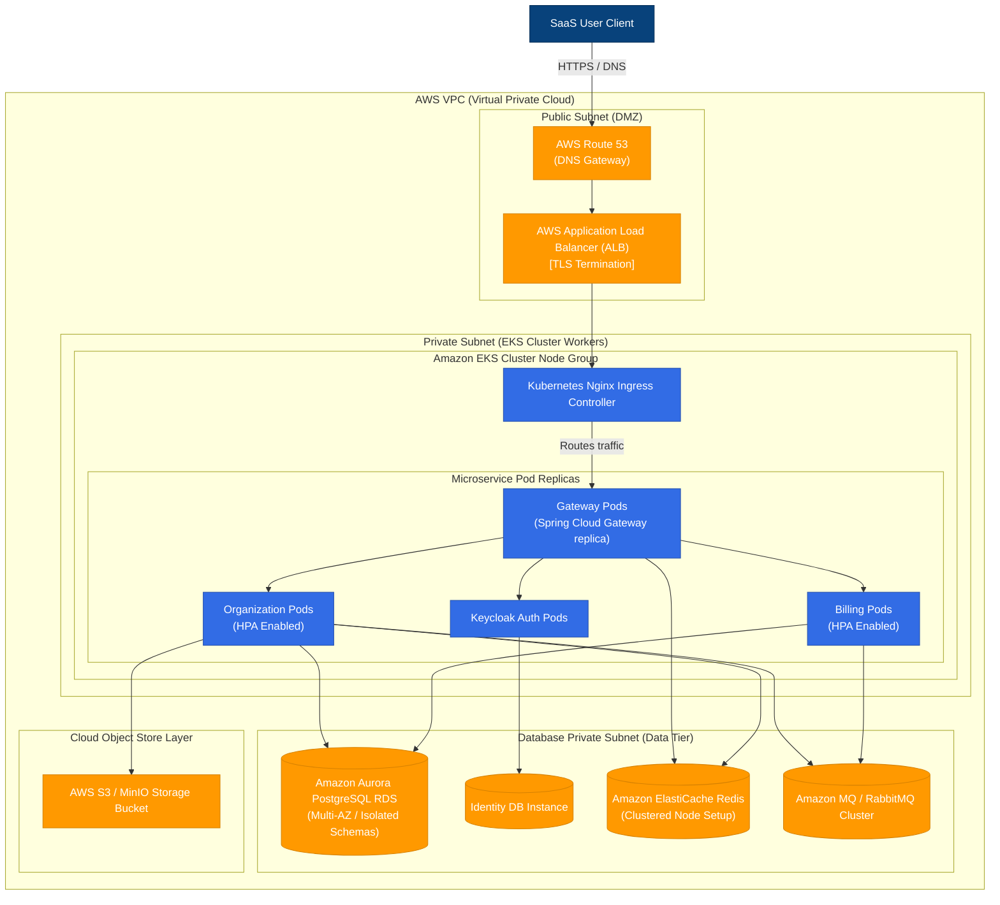

# Architecture: Deployment (C4 Level 4)

This document describes the physical deployment architecture (C4 Level 4) for the **Atlas SaaS Platform Accelerator** deployed to a public cloud environment (AWS) using Kubernetes (EKS).

---

## 1. Physical Deployment Diagram

---

## 2. Infrastructure Node Layout

### 1. Networking (VPC Setup)
*   **VPC Partitioning:** Divided across three Availability Zones (AZs) for high availability.
*   **Subnet Separation:**
    *   **Public Subnets:** Houses the public-facing AWS Application Load Balancers (ALBs) and NAT Gateways.
    *   **Private Subnets:** Houses EKS worker nodes. No public IP addresses are assigned to worker instances; all outbound traffic passes through the NAT Gateway.
    *   **Isolated Database Subnets:** Enforces security by isolating databases, preventing all direct traffic except from authorized microservice security groups.

### 2. Orchestration Tier (Amazon EKS)
*   **Nginx Ingress Controller:** Receives routed requests from the AWS ALB, matches host headers, and routes requests to the `gateway-service` Kubernetes ClusterIP.
*   **Horizontal Pod Autoscaler (HPA):** Monitors CPU and memory utilization metrics. Scale actions spin up additional pod replicas when utilization crosses a 75% threshold.
*   **Graceful Termination:** Pods are configured with a `preStop` hook to complete pending transactions and close open database connections gracefully before terminating.

### 3. Data Tier
*   **Amazon Aurora PostgreSQL:** Implements database replication across multiple Availability Zones. Primary node handles writes; read replicas handle scaling queries.
*   **Amazon ElastiCache Redis:** Configured with replication nodes across AZs, serving rate limiter and session storage caching.
*   **Amazon MQ (RabbitMQ):** Fully managed, clustered message broker instance supporting transactional outbox delivery logs.
