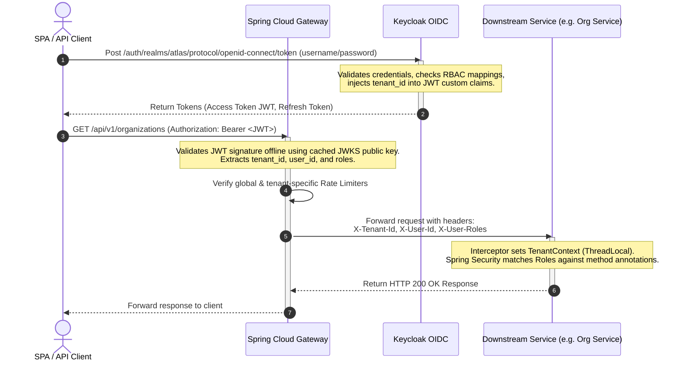
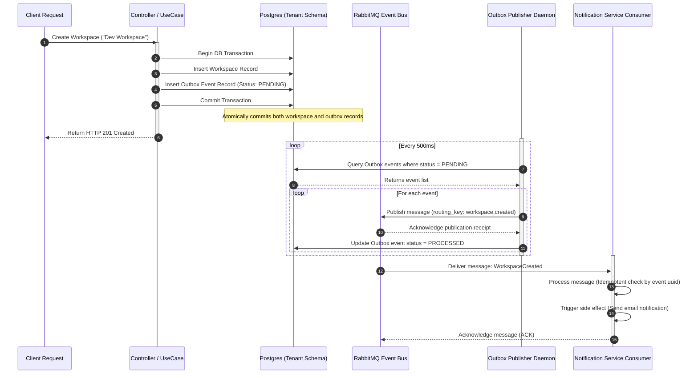

# Architecture: Request & Message Flows

This document details the request execution paths, authentication lifecycle, and transactional messaging flows of the **Atlas SaaS Platform Accelerator**.

---

## 1. Authentication & JWT Authorization Lifecycle

This flow illustrates how a client signs in, obtains a JWT from Keycloak, and uses it to call tenant-restricted API endpoints.

---

## 2. Transactional Outbox Pattern & Event Flow

To maintain consistent state without distributed transactions (avoiding 2PC/XA), Atlas uses the Transactional Outbox Pattern.

