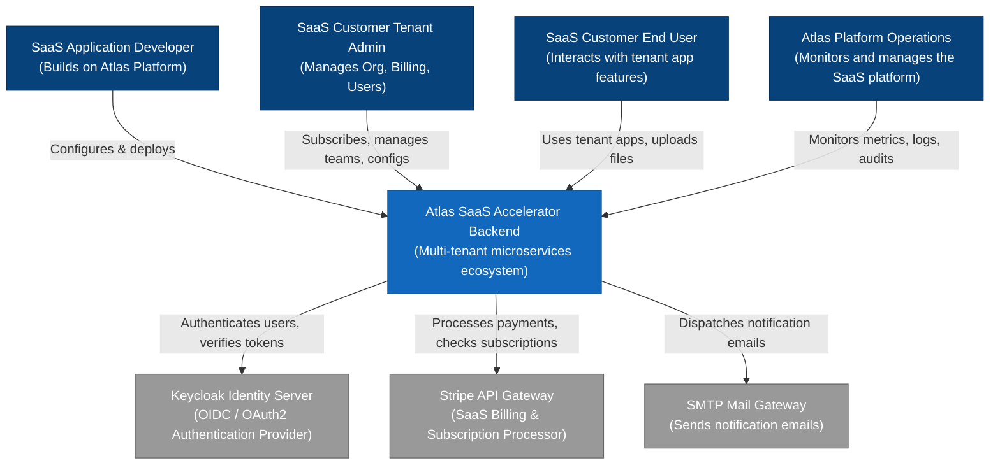

# Architecture: System Context (C4 Level 1)

This document details the System Context diagram for the **Atlas SaaS Platform Accelerator**. It outlines the actors in the system, key system boundaries, and external dependencies.

---

## 1. System Context Diagram

---

## 2. Description of Actors

1.  **SaaS Application Developer:** An engineer using the Atlas framework to build tenant-aware business logic without worrying about foundational capabilities.
2.  **SaaS Customer Tenant Admin:** The administrator representing a tenant organization. They register, purchase subscription plans, configure member rules, invite colleagues, and view billing history.
3.  **SaaS Customer End User:** The consumer of the tenant organization's services who performs day-to-day work, creates items, and uploads data.
4.  **Atlas Platform Operations:** SREs and platform engineers who configure global rate limits, monitor overall performance dashboards, audit security logs, and review platform telemetry.

---

## 3. External Integrations

*   **Keycloak Identity Server:** Offloads core identity functions (password hashes, multi-factor authentication, social login identity federation) and issues cryptographic OIDC access tokens (JWTs) representing authenticated contexts.
*   **Stripe API Gateway:** Handles complex PCI-compliant credit card processing, billing cycles, automated dunning, and invoicing.
*   **SMTP Mail Gateway:** Handles routing and deliverability of user notification and onboarding emails.
